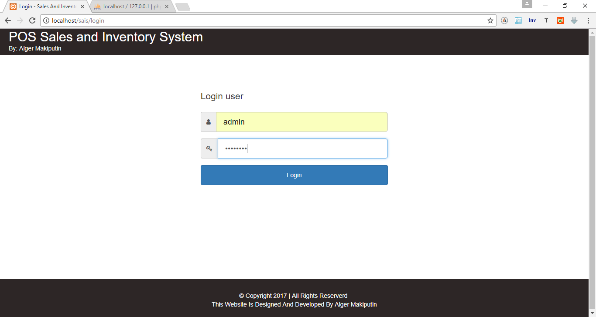
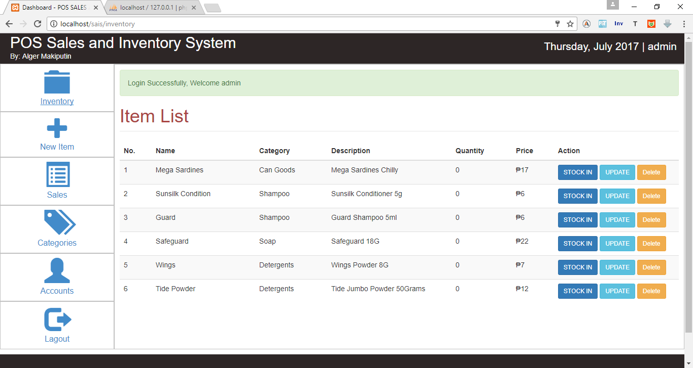
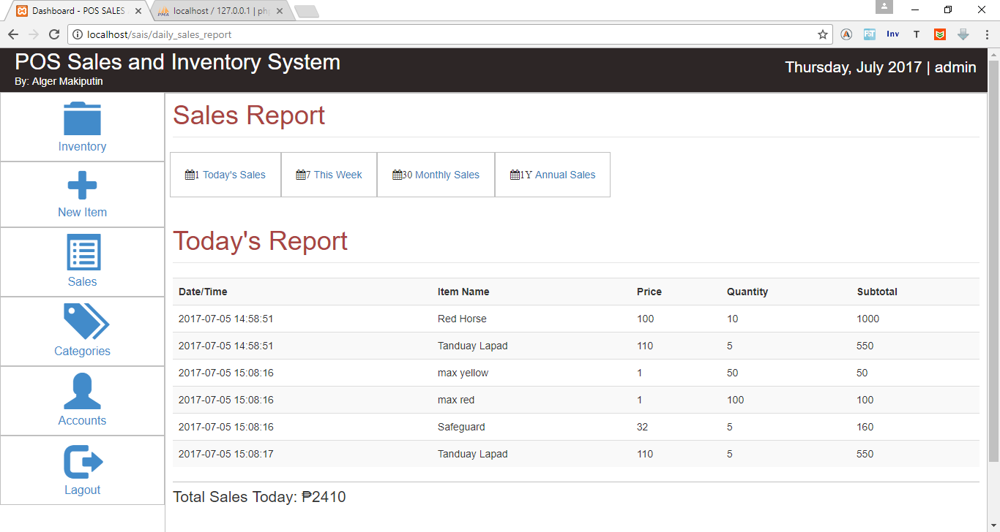
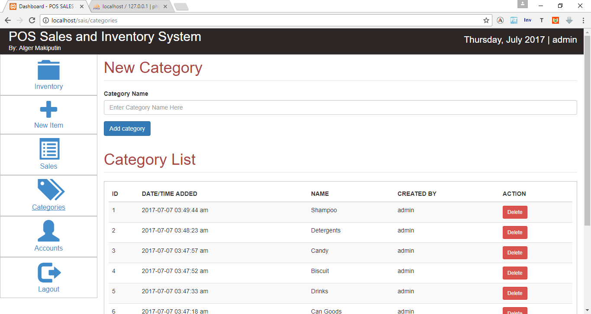
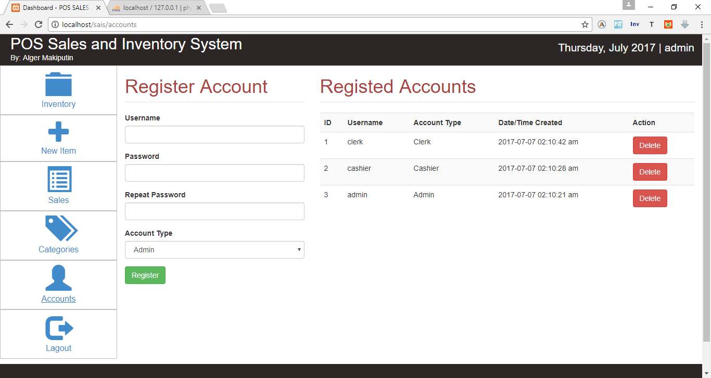
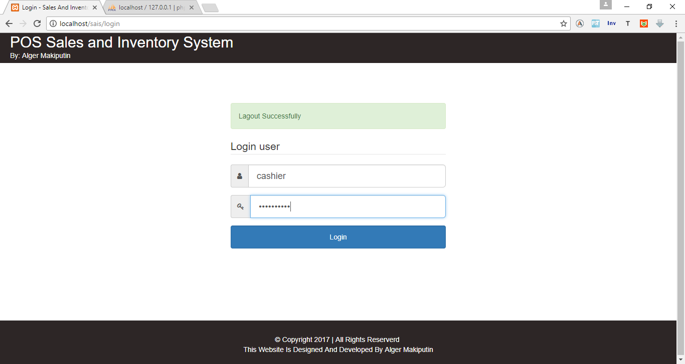
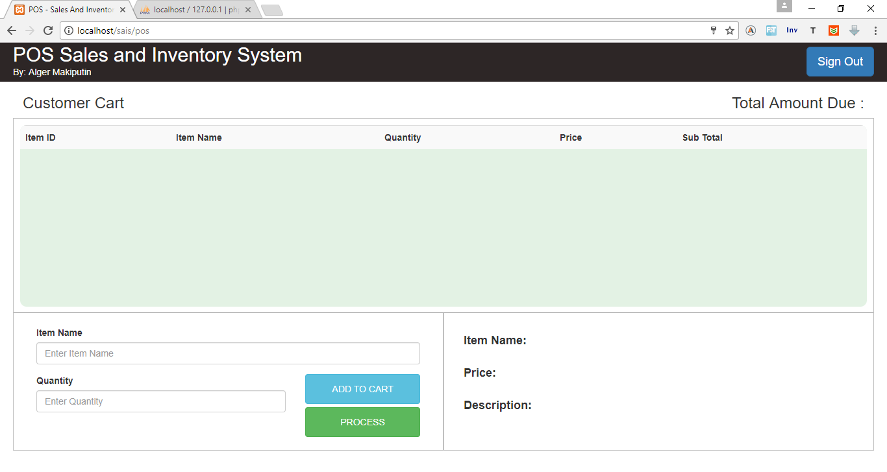
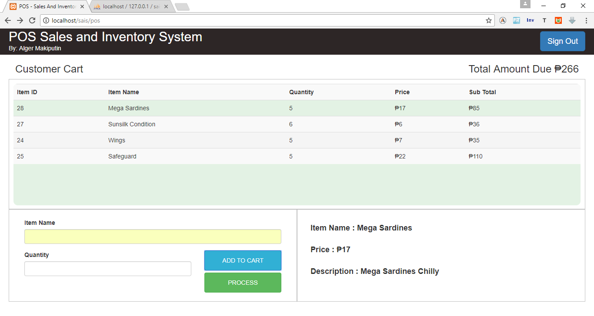
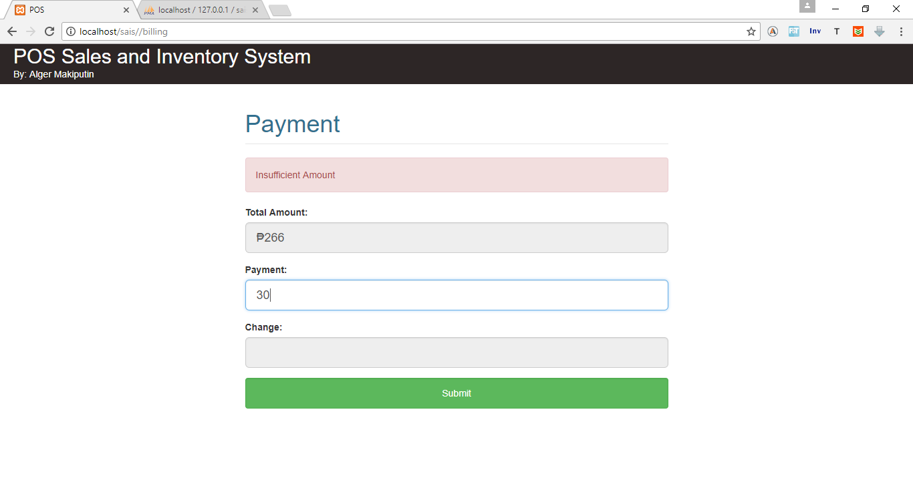
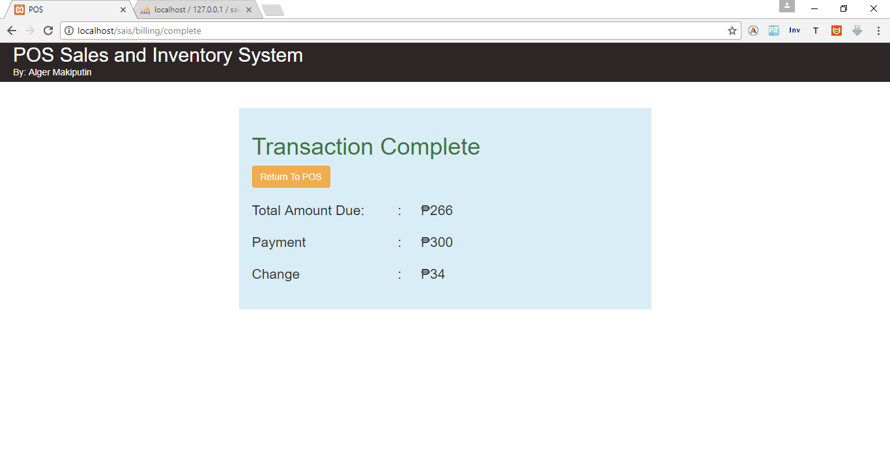

# POS-Sales-And-Inventory-Management-System-Built-With-Codeigniter
Web Base POS Sales And Inventory System Built Using Codeigniter Framework

This Is The Login Page

Their are 3 types of users.
1. Cashier
2. Clerk
3. Admin
If Cashier user will redirect to POS page, if clerk or admin will be redirect to inventory page. 
In this image admin is login. 
I miss spelled logout for lagout here :( 

This Is the Add New Item Form

You can also view your daily/weekly/monthly/yearly sales. navigate through the navigation on the top of the table.

Add Category Form, When you register and Item You will select a category of the item. so first you have to register it's category.

Simple Account Registration form only getting few details. only admins can access this. when the user is clerk this panel will hide. the password is also hash before saving into the database.

Now Lets try Logging In Cashier Type Account.

Cashier Account Will redirect In the POS interface.

The cashier will enter the name of the item in the item name field and it will autocomplete and the item info will display in the right side. 

Payment 

Displays the total amount, payment and change for the customer.

